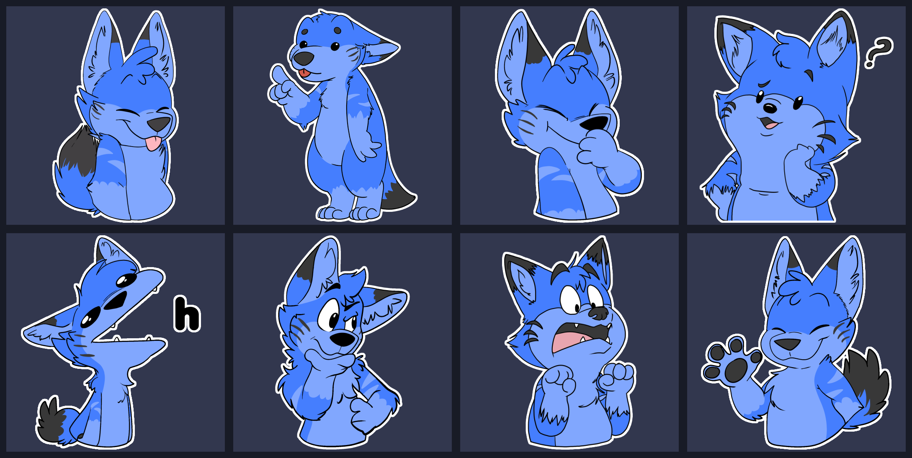

# Sticker Collage Maker

A simple python script to create Telegram sticker collages.

## [Download](https://github.com/DexFolf/StickerCollageMaker/releases/latest)

## Requirements
### If you're running the .exe
[ImageMagick](https://imagemagick.org/script/download.php) ([Windows](https://imagemagick.org/script/download.php#windows) | [Mac](https://imagemagick.org/script/download.php#macosx) | [Linux](https://imagemagick.org/script/download.php#linux))

None of the installer's checkboxes are necessary for this script to work.

### If you're running the .py
[Python3](https://www.python.org/downloads/)

[Wand](https://pypi.org/project/Wand/)
(or alternatively, run `pip install -r requirements.txt`)

[ImageMagick](https://imagemagick.org/script/download.php) (none of the installer's checkboxes are necessary for this script to work.)

## Usage
Place the .exe or .py file in the directory you wish to collage, then run it and follow the onscreen instructions.

## Notes
Currently the program does not support command line parameters or accessing directories other than the one it's in, but contributions to add this functionality are welcome.
